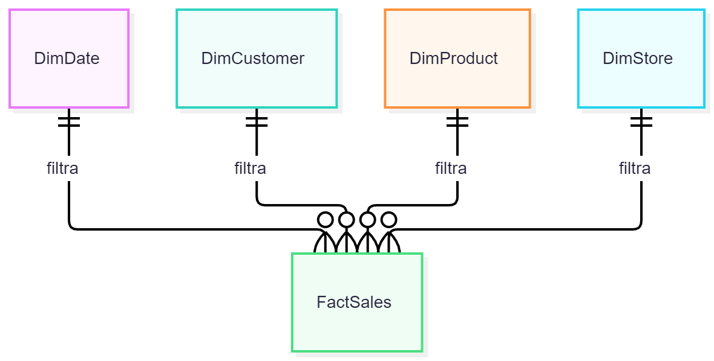
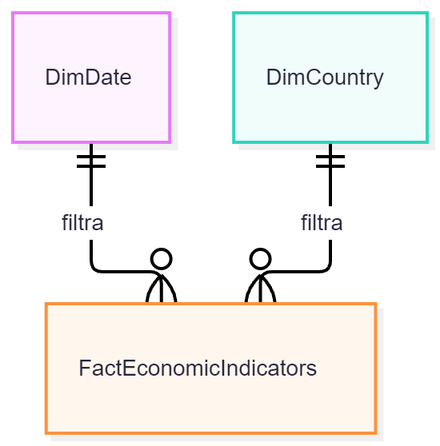

# ADR 002: Designing Separate Star Schemas for Retail and Economy

## 1. Context

The data platform requires integrating granular commercial transactions with aggregated macroeconomic indicators from the World Bank. To enable efficient and accurate analysis using Business Intelligence tools (Power BI), it is necessary to design the physical analytical model that will reside in PostgreSQL. The primary architectural challenge lies in integrating data sources that operate at drastically different levels of detail.

## 2. Decision

It has been decided to implement two independent star schemas instead of forcing all facts into a single centralized model.

### Comercial Model (Retail)

The first model is designed to answer purely business-related questions. The central fact table, `FactSales`, receives direct filters from four surrounding dimensions: `DimDate`, `DimCustomer`, `DimProduct`, and `DimStore`.

### Economic Model (Macroeconomic Context)

The second model encapsulates exclusively World Bank data. The fact table, `FactEconomicIndicators`, is filtered by only two dimensions: `DimDate` and `DimCountry`.

## 3. Technical Justification (The clash of granularities)

Physically separating these models is mandatory due to the disparity in their granularity: 
- **Fine Granularity:** `FactSales` operates at the transaction-line level. An event occurs at a precise second, involving a specific product and an individual customer.
- **Aggregated Granularity:** `FactEconomicIndicators` operates at a macro level (country and year). An event represents an entire economy over the course of 365 days.

**Golden Rule:** These two fact tables must never be joined directly (via an SQL `JOIN`) simply because they share a country and a date. If a static annual indicator (such as 5% inflation) were joined directly to a million sales transactions occurring in that year, the database engine would duplicate that 5% figure a million times. Any subsequent summation or averaging in Power BI would result in massively inflated and erroneous metrics.

## 4. Impact

- **Pros:** Prevents the incorrect calculation of analytical metrics (avoiding the "many-to-many chasm trap" issue). It keeps the ETL pipeline modular and facilitates the future addition of new indicators or transaction types.

- **Design Considerations:** Since the models are separate within the database, cross-analysis (e.g., comparing sales vs. inflation) must be handled at the semantic layer (Power BI). This is achieved by connecting both star schemas via "conformed" or shared dimensions—specifically, by linking both fact tables to a single master calendar table (`DimDate`) and a geography table.